# 1. Introduction

## Spatial Motivation

### The Potts Model
* Spatial models on regular lattices (pixels) often employ **Markov Random Fields (MRF)**.
* The **Potts Model** is the classical standard for capturing local neighborhood dependence.

::: {#fig-potts-panel layout-ncol=2}
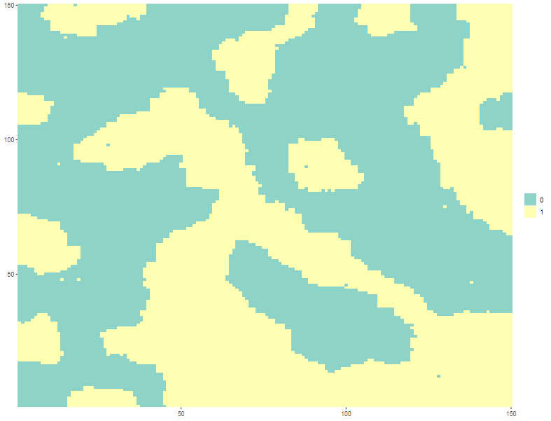{#fig-astrong height="40%"}

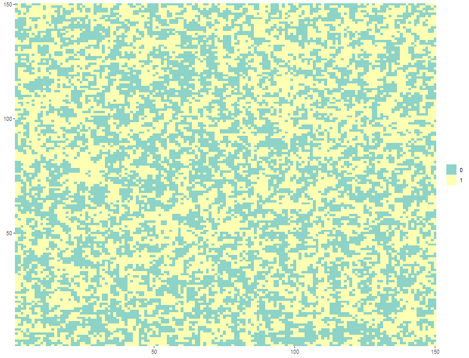{#fig-aweak height="40%"}
:::

### The Potts Model
* **Energy Function:** For the traditional Potts Model, we define a spatial field $Z$ where the local probability of pixel $i$ taking class $k$ is proportional to $exp(\eta_i(k))$:
  $$\eta_i(k) = \alpha \sum_{j \in N(i)} \mathds{1}(Z_j = k) + \beta \mathds{1}(k = 0)$$
* **Parameters Meaning:**
  * **$N(i)$:** Pixel $i$ neighbors.
  * **$\alpha$ (Uniformity):** Local attraction between neighboring pixels (smoothing).
  * **$\beta$ (Global Abundance):** Force favoring/penalizing the background (class $0$).

### The Potts Model

::: {#fig-potts-panel2 layout-nrow=2}

{#fig-astrong height="35%"}

{#fig-aweak height="35%"}

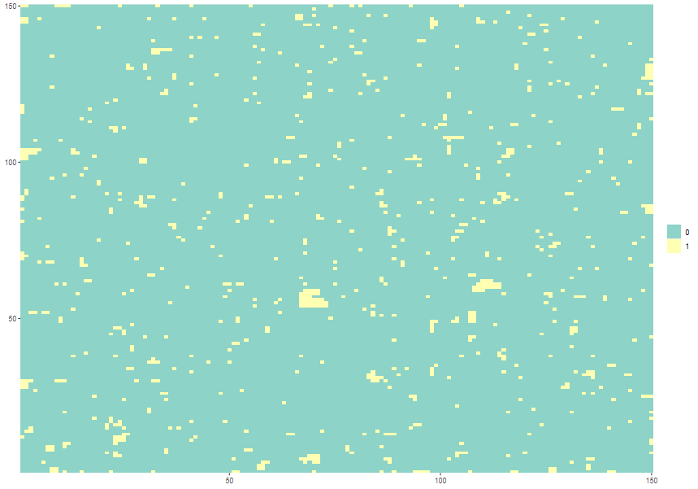{#fig-bhigh height="35%"}

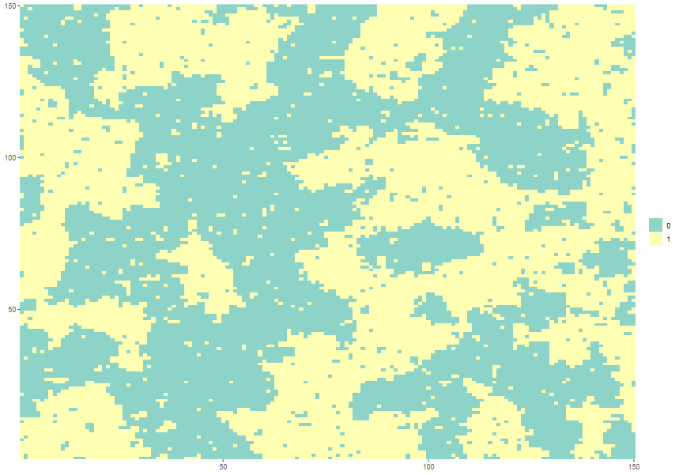{#fig-blow height="35%"}

:::

### The Spacial Limitation
* Many real images and textures possess spacial patterns we call **"seeds"** that may attract or repel colors.
* **Our Proposal:** Incorporate spacial seeds that exert radial influence on the classes.
* **Objective:** Propose a reparameterized model that describe the inclusion of centroids/seeds, and validate its inference under a hidden model.

::: {#fig-potts-panel layout-ncol=2}
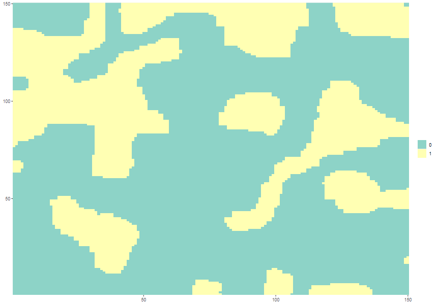{#fig-astrong height="35%"}

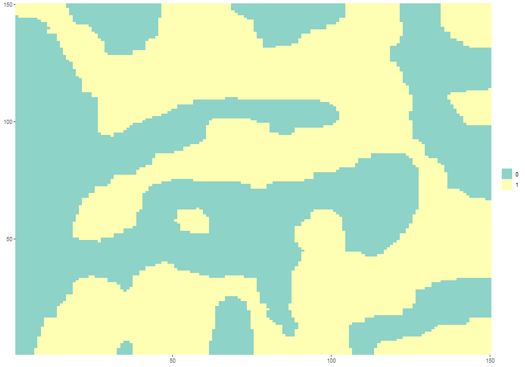{#fig-aweak height="35%"}
:::

# 2. The Proposal

## Mathematical Formulation

### Potts Reparameterized with Seeds
* **Enhanced Local Energy Function:** To address the isotropic limitation of the Potts model, we introduce a few elements to handle
the spacial centrality bias in our local energy funtion:
  $$\eta_i(k) = \alpha \sum_{j \in N(i)} \mathds{1}(Z_j = k) + \beta \mathds{1}(k = 0) + \sum_s \frac{\delta_s}{1 + d(i, s)} \mathds{1}(c_s = k)$$
* **Parameters Meaning:**
  * **$\alpha$ (Uniformity):** Local attraction between neighboring pixels (smoothing).
  * **$\beta$ (Global Abundance):** Force favoring/penalizing the background (class $0$).
  * **$\delta_s$ (Centrality):** Radial attraction/repulsion of the seed $s$.
  * **$d(i, s)$:** Distance between pixel $i$ and seed $s$.
  * **$c_s$:** Class/color related to the seed.

### Potts Reparameterized with Seeds
* **Enhanced Local Energy Function:**
  $$\eta_i(k) = \alpha \sum_{j \in N(i)} \mathds{1}(Z_j = k) + \beta \mathds{1}(k = 0) + \sum_s \frac{\delta_s}{1 + d(i, s)} \mathds{1}(c_s = k)$$

* **Enhanced Global Energy Function:** 
  $$
  \begin{aligned}
  U(\omega) = \alpha \sum_{\{i,j\} \in E} \sum_{k \in S} \mathds{1}(\omega_i = k)\mathds{1}(\omega_j = k) + \beta \sum_{i \in N}\mathds{1}(\omega_i = 0) +  \\
  \sum_{i \in N}  \sum_s \frac{\delta_s}{1 + d(i, s)} \mathds{1}(\omega_i = c_s)
  \end{aligned}
  $$

### The Threshold of the "Area of Influence"
* **Equilibrium of Forces:** The local seed attraction competes against the global abundance of the background class.
* **Null Boundary:** Under our model, ignoring neighborhood smoothing, they cancel out when:
  $$\eta_i(0)= \eta_i(k) \implies d_{i,s} = \frac{\delta_s}{\beta}-1$$
* **Spacial Transition:** That "Null Boundary" radius gives to the model a rough outline of the objects in the image.
  * **Within radius $d_i$:** The seed attraction dominates the local probability.
  * **Beyond radius $d_i$:** The class 0 dominates.
  * **Smoothing effect:** Depending on $\alpha$ value, pixels can be affected more by its neighbors than by the radius rule.

### The Theoretical Bottleneck: Intractable Likelihood
* **The Gibbs Measure:** The global probability of an image configuration $\omega$ is governed by:
  $$P(\omega) = \frac{1}{Z(\theta)} \exp\{U(\omega)\}$$
* **The Computational Bottleneck:** The term $Z(\theta)$ is the **normalizing constant** (partition function) summed over all lattice configurations $\Omega$:
  $$Z(\theta) = \sum_{\omega \in \Omega} \exp\{U(\omega)\}$$
* For a small $50 \times 50$ grid and $K = 3$ colors, this requires $3^{2500}$ terms, rendering standard Maximum Likelihood impossible.

# 3. Hidden & Hierarchical Models

## Hidden Markov Fields

### The Major Evolution: The Hidden Model (HMRF)
* **The Latent Field:** In segmentation practice, the label field $Z$ (the true texture) is **latent/hidden**.
* **Observed Intensities:** We only observe the noisy, continuous intensities $Y$.
* **Observation Equation (Emission):** Conditionally on the latent label $Z_i = k$, the intensity $Y_i$ is Normal:
  $$Y_i \mid Z_i = k \sim N(\mu_k, \sigma^2)$$
* **Normal Mixture:** Marginalizing over $Z_i$, $Y_i$ forms a spatial mixture of Gaussians:
  $$f(y_i) = \sum_{k=0}^{K-1} P(Z_i = k) \phi(y_i; \mu_k, \sigma^2)$$

### The Major Evolution: The Hidden Model (HMRF)
::: {#fig-potts-panel layout-ncol=2}
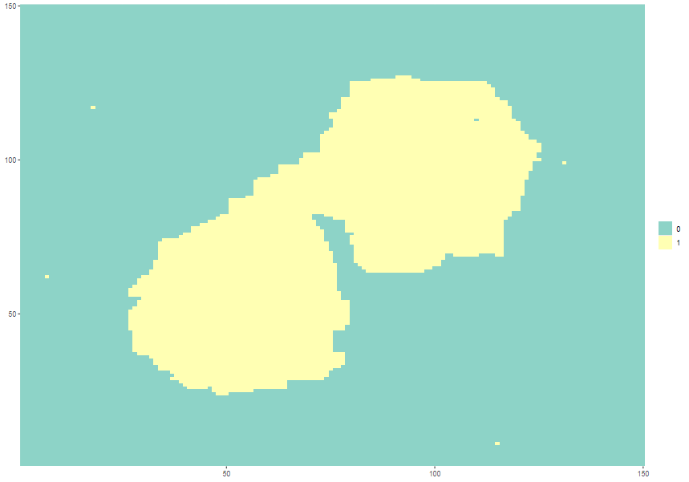{#fig-hiddenz height="35%"}

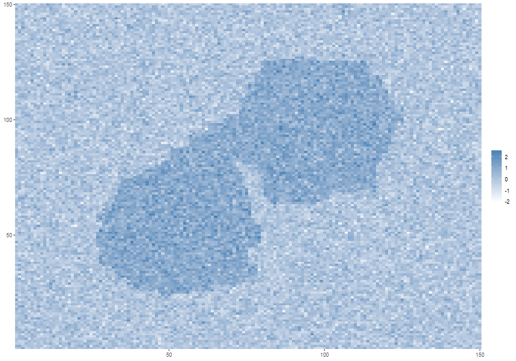{#fig-hiddeny height="35%"}

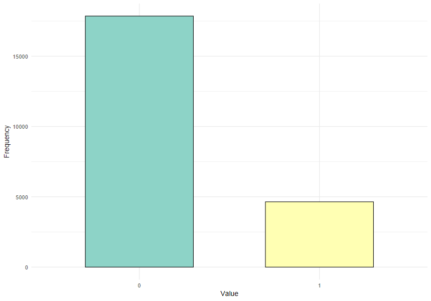{#fig-hiddenzfreq height="35%"}

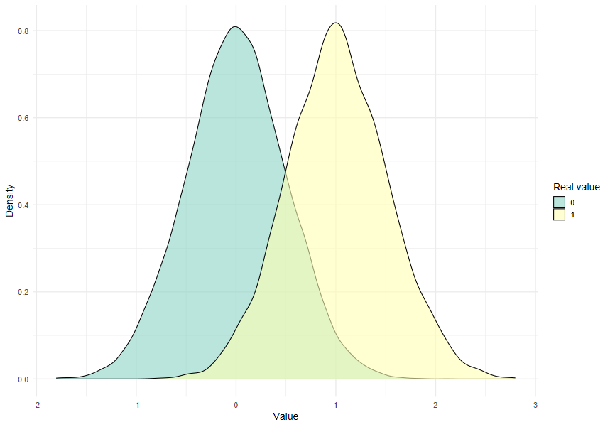{#fig-hiddenydensity height="35%"}
:::

## Hierarchical Framework

### Hierarchical Bayesian Formulation
* **Full Joint Distribution:** Treating $Z$, parameters $\theta$, and seed coordinates $S$ as random variables:
  $$
  \begin{aligned}
  P(Y, Z, \theta) = P(Y \mid Z, \mu, \sigma^2) P(Z \mid \alpha, \beta, \delta, S) \times  \\
  \pi(\alpha)\pi(\beta)\prod_{j=1}^M \pi(s_j)\pi(\delta_j)
  \prod_{k=0}^{K-1} \pi(\mu_k)\pi(\sigma^2)
  \end{aligned}
  $$

* **Prior Distributions:**
  * **Field (Gamma):** $\alpha \sim \text{Gamma}(a_\alpha, b_\alpha)$, $\beta \sim \text{Gamma}(a_\beta, b_\beta)$.
  * **Means (Normal):** $\mu_k \sim N(m_k, \tau^2_k)$ (anchored via K-means).
  * **Variances (Inverse-Gamma):** $\sigma^2 \sim IG(a_\sigma, b_\sigma)$.
  * **Spacial:** Seed position $s_j \sim \text{Unif}(L)$ discretized on the grid.

# 4. Estimation & Algorithms

## MCMC Estimation

### The Metropolis-Hastings Step via Pseudoposterior
* **Fixing the Bottleneck:** Because the true likelihood is intractable, we replace $P(Z \mid \theta)$ with the Pseudolikelihood $PL(\theta; Z)$ in the Metropolis-Hastings acceptance step.
$$
\begin{aligned}
P(Z_i = k \mid Z_{-i}, \theta) = \frac{P(Z_i = k, Z_{-i} \mid \theta)}{P(Z_{-i} \mid \theta)} = \\
\frac{\frac{1}{Z(\theta)} \exp\{U(Z_i = k, Z_{-i})\}}{\sum_{\ell=0}^{K-1} \frac{1}{Z(\theta)} \exp\{U(Z_i = \ell, Z_{-i})\}}
\end{aligned}
$$

$$PL(\theta; Z) = \prod_{i \in N} \frac{\exp\{\eta_i(z_i)\}}{\sum_{\ell=0}^{K-1} \exp\{\eta_i(\ell)\}}$$

* **The Target Pseudoposterior:** This substitution formally defines our target distribution as the **Pseudoposterior**:
  $$\pi_{\text{pseudo}}(\theta \mid Z) \propto PL(\theta; Z) \pi(\theta)$$

### The Metropolis-Hastings Step via Pseudoposterior
* **Acceptance Probability:** For a symmetric proposal distribution $D(\theta^* \mid \theta)$, a proposed parameter vector $\theta^*$ is accepted with probability $\min(1, A)$, where:
  $$A = \frac{\pi_{\text{pseudo}}(\theta^* \mid Z)}{\pi_{\text{pseudo}}(\theta \mid Z)} = \frac{PL(\theta^*; Z) \pi(\theta^*)}{PL(\theta; Z) \pi(\theta)}$$
* In log-scale, the proposal is accepted if:
  $$\log(U) < \log PL(\theta^*; Z) + \log \pi(\theta^*) - \log PL(\theta; Z) - \log \pi(\theta)$$

### The Metropolis-within-Gibbs Algorithm
0. **Initialization**: Noise parameters $(\mu_k, \sigma^2)$ are calculated via K-means over the observed intensity $Y_i$ and they are used among the spacial parameters prioris to generate the initial $Z^{(0)}$ hidden field.
1. **Step A (Metropolis-Hastings - Field):** Propose $(\alpha, \beta, \delta)$ via a random walk, evaluated over the **Pseudolikelihood (PL)** (but can also be initialized by user-chosen prioris).
2. **Step B (Metropolis-Hastings - Seeds):** Propose discrete 1-pixel steps for the coordinates $(x,y)$ of the seeds.
3. **Step C (Gibbs - Latent Field):** Sample $Z_i^{(t)}$ conditioned on its neighbors and the observed intensity $Y_i$.
4. **Step D (Gibbs - Noise):** Sample new $(\mu_k, \sigma^2)$ directly from closed-form analytical distributions.

### Full Conditionals and Conjugacy
* **Updated Posterior Mean ($\mu_k$):** The full conditional under conjugate priors is a Normal:
  $$m_{\text{post}} = \frac{\frac{m_k}{\tau^2_k} + \frac{\sum_{i: Z_i=k} y_i}{\sigma^2}}{\frac{1}{\tau^2_k} + \frac{n_k}{\sigma^2}}$$
  $$\tau_{\text{post}} = (\frac{1}{\tau^2_k} + \frac{n_k}{\sigma^2})^{-1}$$
* **Updated Posterior Variance ($\sigma^2$):** Follows an Inverse-Gamma:
  $$a_{\text{post}} = a_\sigma + \frac{n_k}{2}$$
  $$b_{\text{post}} = b_\sigma + \frac{1}{2} \sum_{i: Z_i=k} (y_i - \mu_k)^2$$

## Computational Efficiency

### Code Engineering & Stability Challenges
* **Rcpp for Real-World Grids:** Recreated the local neighborhood and distance calculations in **C++ via Rcpp** to make iterations highly efficient.

# 5. Application

## Real-World Image Results

### Image Segmentation Application
* **The test:** In order to evaluate our model in real world data, a near-infrared image by @aslahishahri2021rgb was taken for testing.
* **Prioris:**
    
  | | |
  | :--- | :--- |
  | &bull; $\alpha$ shape = 2 | &bull; $\mu$ mean (m) = 0 |
  | &bull; $\alpha$ rate = 1 | &bull; $\mu$ sd (tau) = 0.001 |
  | &bull; $\beta$ shape = 2 | &bull; $\sigma$ a = 10 |
  | &bull; $\beta$ rate  = 1 | &bull; $\sigma$ b = 10 |
  | &bull; $\delta$ shape = 10 | &bull; $\delta$ rate = 0.5 |

* **Initialization:**
  * $\alpha$ = 2
  * $\beta$ = 2
  * $\delta_{1,2,3}$ = 30

### Image Segmentation

::: {#fig-realimage-panel layout-ncol=2}
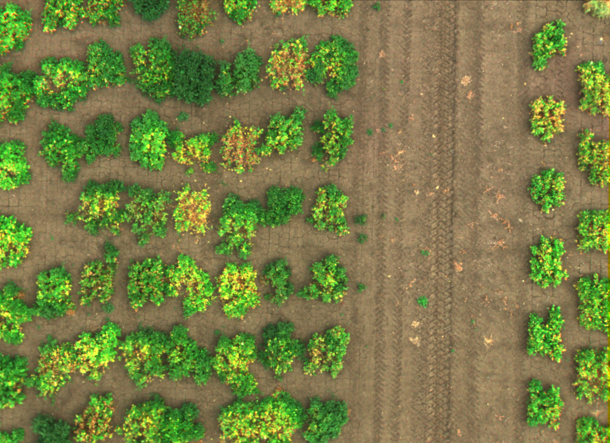{#fig-imagereal height="35%"}

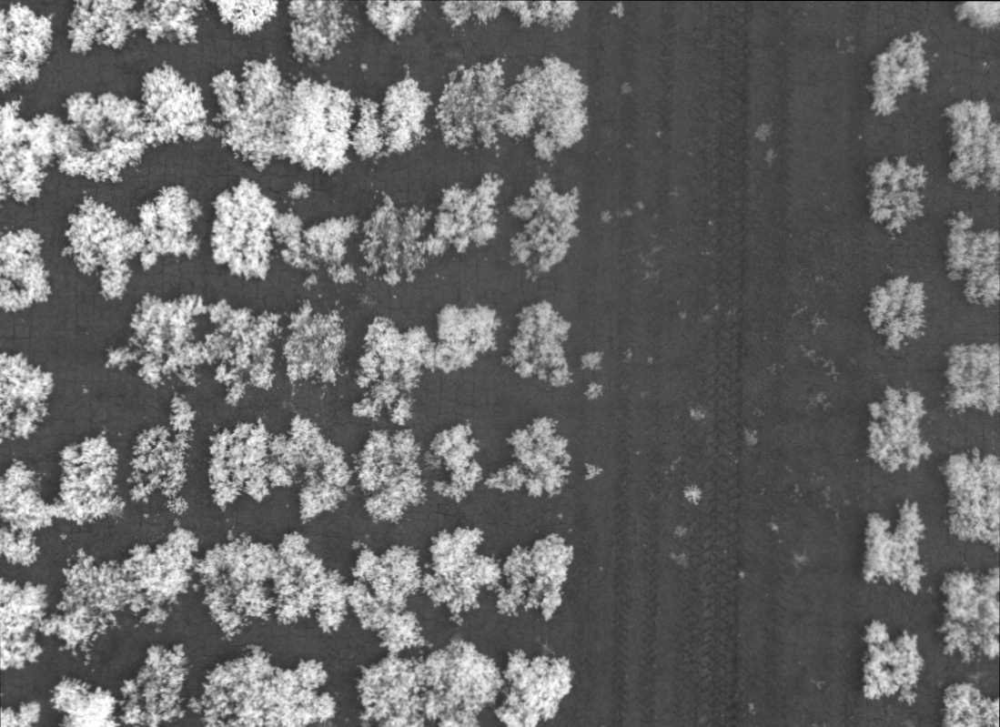{#fig-imagerealNIR height="35%"}

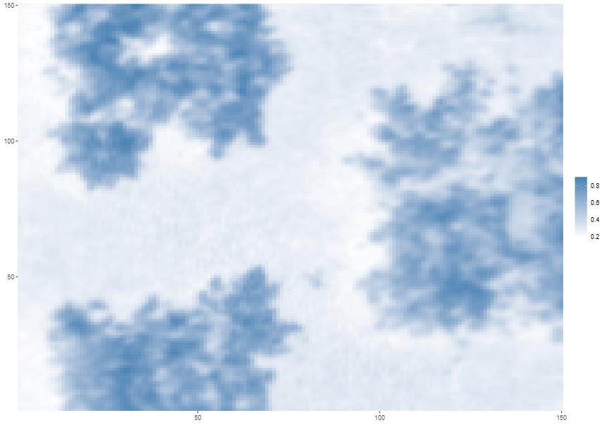{#fig-imageY height="35%"}

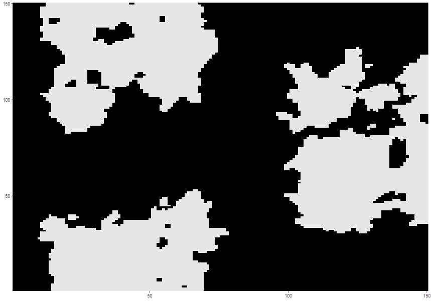{#fig-ImageZ0 height="35%"}
:::

### Seed Locations

::: {#fig-realimage-panel layout-ncol=2}
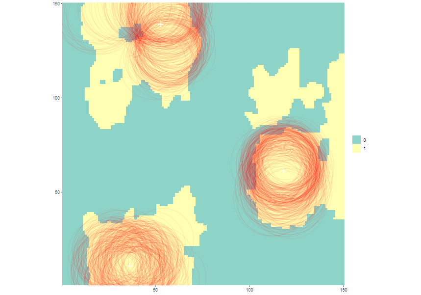{#fig-seedscircles height="40%"}

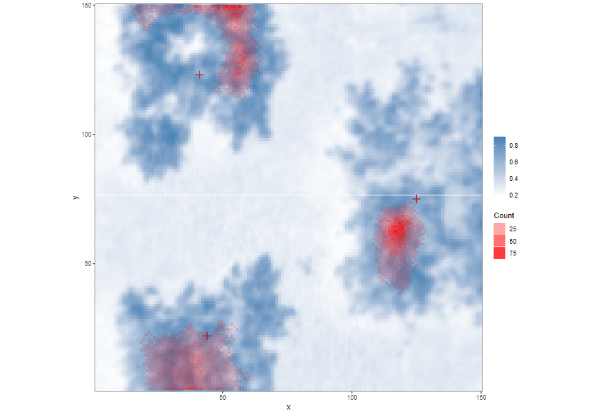{#fig-seedsheatmap height="40%"}
:::

### Image Segmentation Application Results
* **Good initialization:** Testing prioris may lead to a good first $Z$.
* **Fast Convergence:** After step 30001, parameters did not change drastically. The entire pipeline took ~7 minutes for 10000 steps.
* **Accurate seeds:** Seed plots showed that seeds were well estimated as well as their influence area, but could get confused with background-within cases.

## Conclusion

### Conclusion
* **Key Conclusions:** The MWG pipeline makes inference in spacially complex HMRFs viable and robust.
* **Efficiency:** Estimation via Pseudoposterior balances computational cost and statistical precision.

### Acknowledgements & Contact

**Wesley Cabral Alves**

*IMECC – University of Campinas (Unicamp)*

* **Email:** `w225825@dac.unicamp.br`
* **GitHub:** [github.com/wescabral](https://github.com/wescabral)

**Questions & Discussion**  
Thank you for your attention! Feel free to reach out for questions.

## References 

### References 
::: {#refs} 
:::

### Parameters Convergence

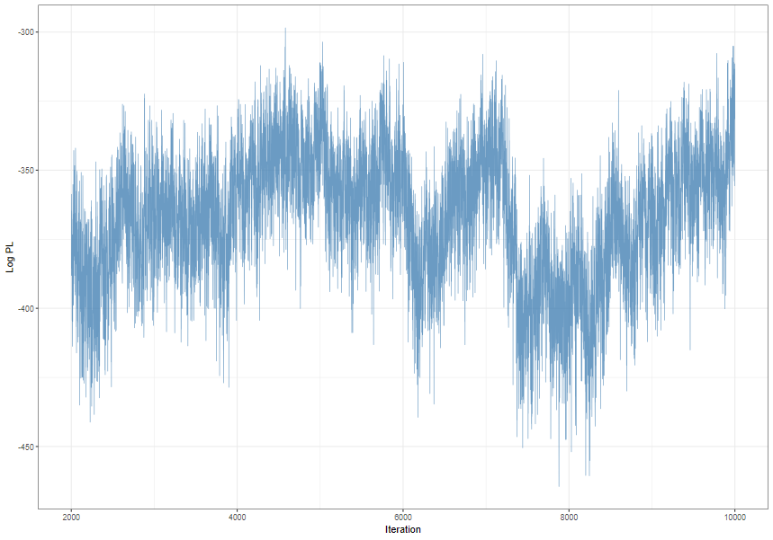{#fig-logpl height="90%"}

### Parameters Convergence

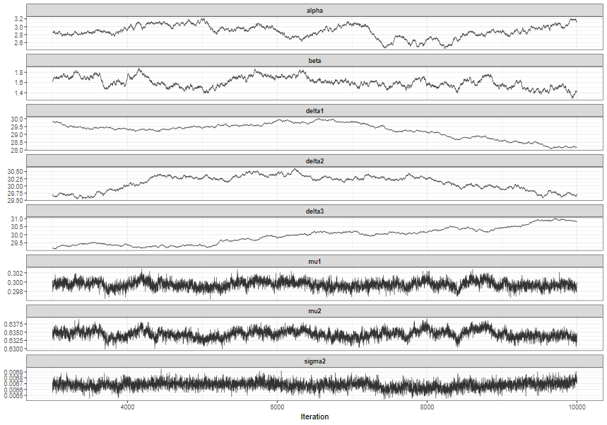{#fig-convergence height="90%"}

### Parameters Convergence

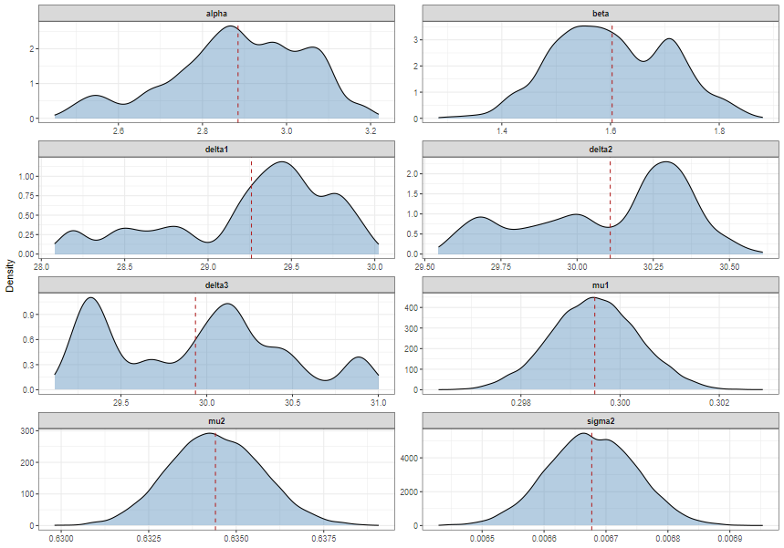{#fig-distributions height="90%"}
